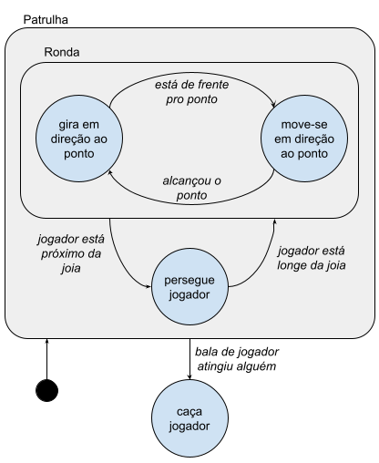

# Exemplo de implementação de uma Máquina de Estados Hierárquica

Este código tem como objetivo ilustrar uma forma de implementar uma máquina de estados hierárquica. No exemplo, há também um gerenciador de eventos, tratados como mensagens disparadas e processadas pelos NPCs.

Para testar, basta carregar o arquivo `index.html` (por exemplo, no live-server no vscode).

No "jogo", você (jogador) controla o personagem verde usando as teclas W (ir em frente), A (girar à esquerda), D (girar à direita) e ' ' (tiro), enquanto a IA controla os personagens azuis, fazendo-os proteger suas "joias". A imagem abaixo mostra a máquina hierárquica implementada (o ponto preto indica o estado inicial).

